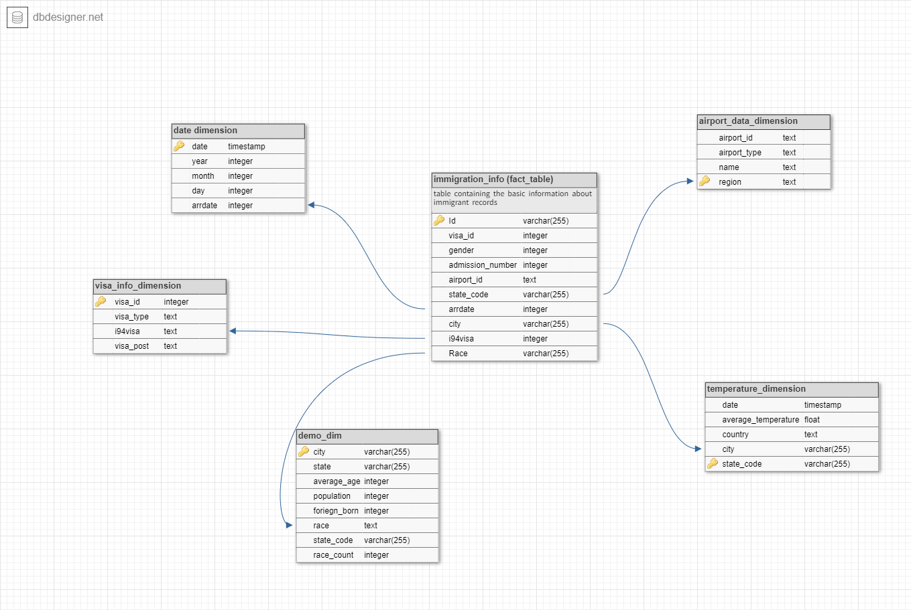
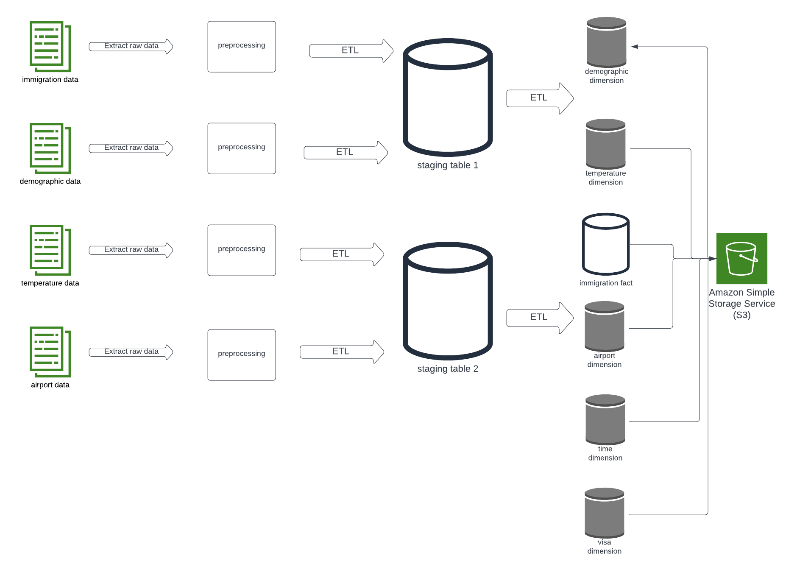

# Data engineering project 
## Objective
This project takes a look at different data samples gathered from different sources and aims to provide a pipeline
that facilitate the analysis of said Data.

The Capstone project template explains in details how the project was formulated and explains the tools ,steps,etc
that came in use for this project 

The data analysis folder contains visuals and report formulated on the final version of the data using Power BI

The etl.py automates the ETL process for this project and stores the data in AWS s3.

## Summary
- This project makes use of various Big Data processing technologies including:
    - Apache Spark, because of its ability to process massive amounts of data as well as the use of its unified analytics engine and convenient APIs
    - Pandas, due to its convenient dataframe manipulation functions
    - Matplotlib, to plot data and gain further insights
    - AWS s3, due it's data storage feasibility and it's accessibility s3 was chosen to host the final formulated tables to keep track of the data monthly

## Datasets:
- i94 Immigration Sample Data: Sample data of immigration records from the US National Tourism and Trade Office. This data source will serve as the Fact table in the schema. This data comes from https://travel.trade.gov/research/reports/i94/historical/2016.html.
- World Temperature Data world_temperature. This dataset contains temperature data in various cities from the 1700’s to 2013. Although the data is only recorded until 2013, we can use this as an average/gauge of temperature in 2017. This data comes from https://www.kaggle.com/berkeleyearth/climate-change-earth-surface-temperature-data.
- US City Demographic Data: Data about the demographics of US cities. This dataset includes information on the population of all US cities such as race, household size and gender. This data comes from https://public.opendatasoft.com/explore/dataset/us-cities-demographics/export/.
- Airport Codes: This table contains the airport codes for the airports in corresponding cities. This data comes from https://datahub.io/core/airport-codes#data.

## Data model
A star schema was chosen to host the data needed from the stated datasets,the following figure describes said schema:

 - The steps for this project is as follows:
    - extract the data from the datasets and perform data preprocessing tasks on them
    - create the Temporary staging tables to host the cleaned data
    - Use the staging tables to populate the star schema 
    - Store the fact and dimensions tables in parquet form and upload them to s3
The following diagram explains the steps in visual form :

## Analysis:
The data analysis markdown file contains visuals and information that answers some analytical questions about the data ,this visuals was created using power bi 
by integrating the s3 bucket to power bi web :

## Note:
The etl.py script automates the ETl processes of the project in case the data needed to be updated constantly 
