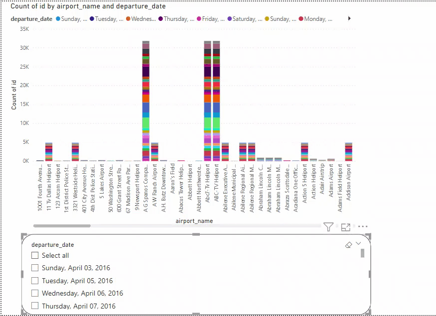

# Immigration data analysis

# Objective

This report takes a look at the star schema that was created in 
the data enigneering project which contains data processed from
various datasets.

The report discusses several analytical questions asked by the users and provides visuals for easy accessiblity to the data.

This report uses power bi visuals to demonstrate the relationships 
in question.

# Questions
## Question 1
### how many citizens arrived on the 23 day and whats their gender?
The following figure demonstrates the amount of people that arrived in the united states on the 23rd of april and shows their 
gender:
.png)

## Question 2
### whats the average temperature of the city with the biggest population?

Using Power Bi map visuals, the following map was created with information on the temperature on different cities :

## Question 3
### whats the names of airport where the arrival happened the most ?
The following line chart provides information on the number of citizens arriving on different dates and on airports where  they landed :

## Question 4
### whats the visatype that most of the female citizens in the cali region have ?
The chart that follows states which type of visa female citizens 
acquired upon their entry in the United states

.png)

